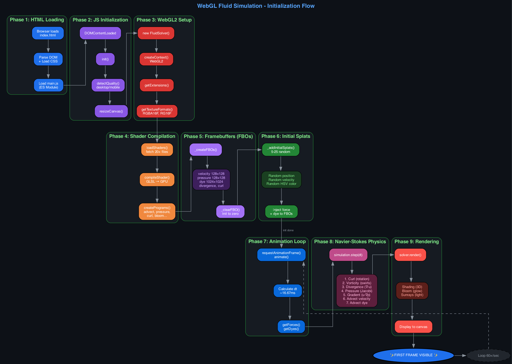

# WebGL Fluid Simulation

A real-time 2D fluid simulation using WebGL2, implementing the Navier-Stokes equations for incompressible fluids.

## Demo

Visit the live demo at: https://gianpaolof.github.io

## Features

- Semi-Lagrangian advection for stable fluid dynamics
- Pressure projection via Jacobi iteration
- Vorticity confinement for enhanced visual turbulence
- Bloom and volumetric light scattering (sunrays) post-processing effects
- Interactive mouse/touch input
- Configurable simulation parameters

## How It Works

The simulation initializes through 9 phases, from loading HTML to rendering the first frame:



### Navier-Stokes Equations

The fluid dynamics are based on the incompressible Navier-Stokes equations:

```
∂u/∂t + (u·∇)u = −∇p + ν∇²u
```

Each frame, the simulation:
1. **Curl & Vorticity**: Computes rotation and amplifies swirls
2. **Pressure Projection**: Solves Poisson equation via Jacobi iteration
3. **Advection**: Moves velocity and dye fields using semi-Lagrangian method

## Credits

This project is heavily inspired by [Pavel Dobryakov's WebGL Fluid Simulation](https://github.com/PavelDoGreat/WebGL-Fluid-Simulation).

The core algorithms and shader implementations are based on his excellent work, with modifications for modularity and code organization.

## References

- [GPU Gems - Fast Fluid Dynamics Simulation on the GPU](https://developer.nvidia.com/gpugems/gpugems/part-vi-beyond-triangles/chapter-38-fast-fluid-dynamics-simulation-gpu)
- [Jos Stam - Stable Fluids (SIGGRAPH 1999)](https://www.dgp.toronto.edu/public_user/stam/reality/Research/pdf/ns.pdf)
- [Pavel Dobryakov - WebGL Fluid Simulation](https://github.com/PavelDoGreat/WebGL-Fluid-Simulation)

## License

MIT
